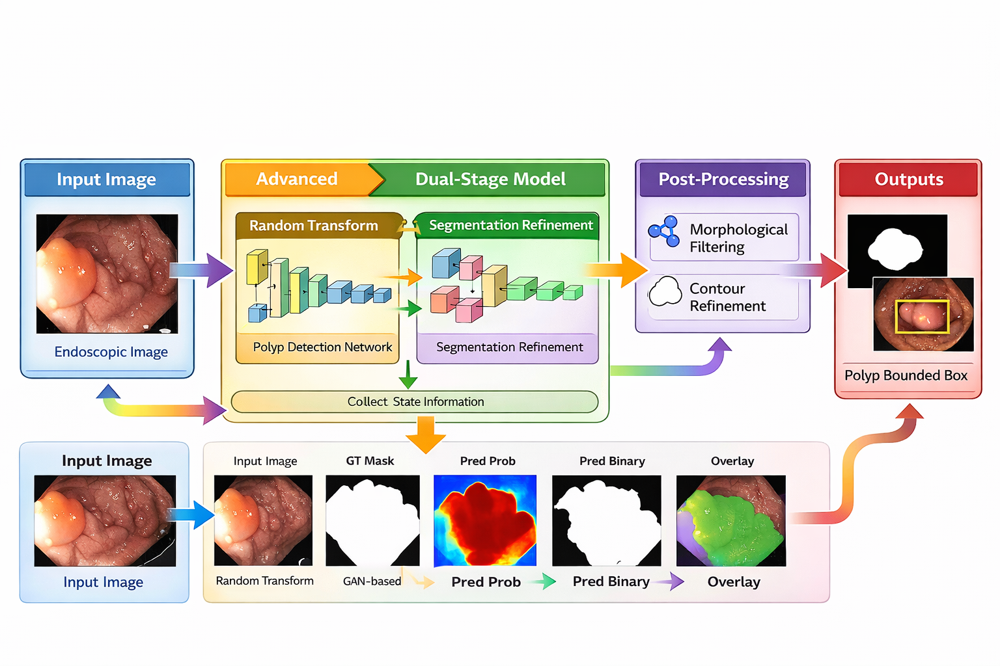
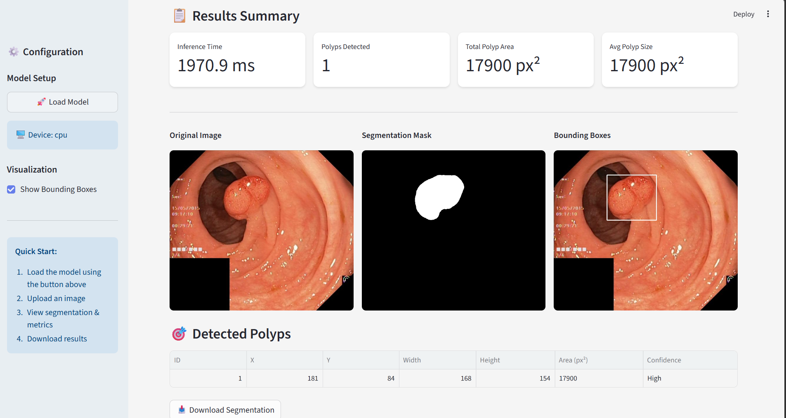

# 🔬 SD-DeepLab Polyp Segmentation

> **A novel structural deep learning approach** — redefining polyp segmentation by embedding geometric priors directly into the network's reasoning, enabling boundary-aware, uncertainty-guided detection that standard architectures fundamentally cannot replicate.

A Streamlit application for colorectal polyp detection and segmentation using the **SD-DeepLab** (Structural DeepLab) deep learning architecture.

---

## 📓 Notebooks & Analysis

| Notebook | Link |
|----------|------|
| Kvasir-SEG Dataset Analysis | [Google Colab](https://colab.research.google.com/drive/1DhHBZflkFwA2qTXaT5ed9CKCZ9Y_Adxm?usp=sharing) |
| Kvasir-SEG Evaluations | [Kaggle](https://www.kaggle.com/code/prabhleenkaur6003/kvasir-segmentation-baseline-models) |
| ColonDB Evaluations | [Kaggle](https://www.kaggle.com/code/prabhleenkaur6003/colondb-segmentation-baseline-models) |
| ClinicalDB Evaluations | [Kaggle](https://www.kaggle.com/code/prabhleenkaur6003/colondb-segmentation-baseline-models) |
| Building a Novel Architecture | [Kaggle](https://www.kaggle.com/code/prabhleenkaur6003/building-a-novel-architecture) |

---

## ✨ Features

- **Real-time Segmentation** — Upload polyp images and get instant segmentation masks
- **Bounding Box Detection** — Automatically extracted from segmentation masks
- **Per-Image Metrics** — Dice, IoU, Precision, Recall, F2-Score, Accuracy, Specificity, HD95
- **Visualization Controls** — Overlay transparency, bounding box toggle, side-by-side comparison
- **Export** — Download segmentation results and metrics as PNG

---

## 🏆 Model Performance

### Kvasir-SEG Test Set (100 samples)

| Metric | Mean | Std | Min | Max |
|--------|------|-----|-----|-----|
| Dice | 0.9077 | 0.1192 | 0.3924 | 0.9879 |
| IoU | 0.8484 | 0.1604 | 0.2441 | 0.9760 |
| Precision | 0.9120 | 0.1299 | 0.2443 | 0.9959 |
| Recall | 0.9310 | 0.1301 | 0.3075 | 1.0000 |


### CVC-ClinicDB (612 samples)

| Metric | Mean | Std | Min | Max |
|--------|------|-----|-----|-----|
| Dice | 0.8330 | 0.2052 | 0.0000 | 0.9865 |
| IoU | 0.7522 | 0.2234 | 0.0000 | 0.9733 |
| Precision | 0.8715 | 0.1515 | 0.0000 | 1.0000 |
| Recall | 0.8610 | 0.2348 | 0.0000 | 1.0000 |

---

## 📐 Architecture

SD-DeepLab extends standard DeepLab by maintaining **4 structural geometric channels** throughout the pipeline — Occupancy Mask (M), Boundary Map (B), Distance Map (D), and Uncertainty Map (U) — which guide attention for more precise polyp detection.




---

## 🖼️ Example Result



---

## 🚀 Quick Start

**Prerequisites:** Python 3.8+, CUDA 11.0+ (optional)

```bash
# 1. Set up environment
python -m venv venv
source venv/bin/activate        # Windows: venv\Scripts\activate

# 2. Install dependencies
pip install -r requirements.txt

# 3. Run the app
streamlit run app.py
```

Open your browser at `http://localhost:8501`, load the model from the sidebar, upload a polyp image, and click **Run Segmentation**.

---

## 🏗️ Project Structure

```
Colorectal polyp segmentation/
├── app.py                    # Main Streamlit application
├── model.py                  # SD-DeepLab architecture
├── utils.py                  # Utility functions
├── requirements.txt          # Python dependencies
├── sddeeplab_final.pth       # Pre-trained model weights
├── Architecture_diagram.png  # Architecture visualization
├── Result_example.png        # Example segmentation result
└── README.md                 # This file
```

---

**Made with ❤️ for better healthcare** 🏥
